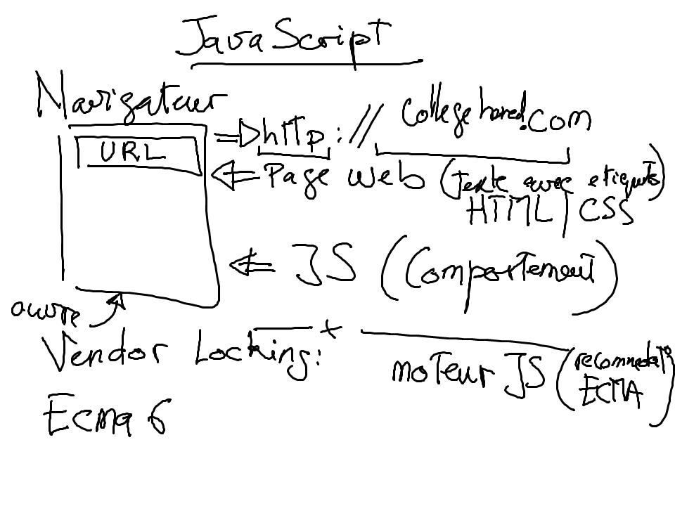

# Script 

## Notion:

### Shawdow DOM

https://developer.mozilla.org/en-US/docs/Web/Web_Components/Shadow_DOM

## Pratique

Creér un programme en JavaScript qui modifie un paragraphe quand on clique sur un bouton

Prendre un example sur https://www.w3schools.com/js/

Creer son propre repertoire avec son numero d'etudiant

