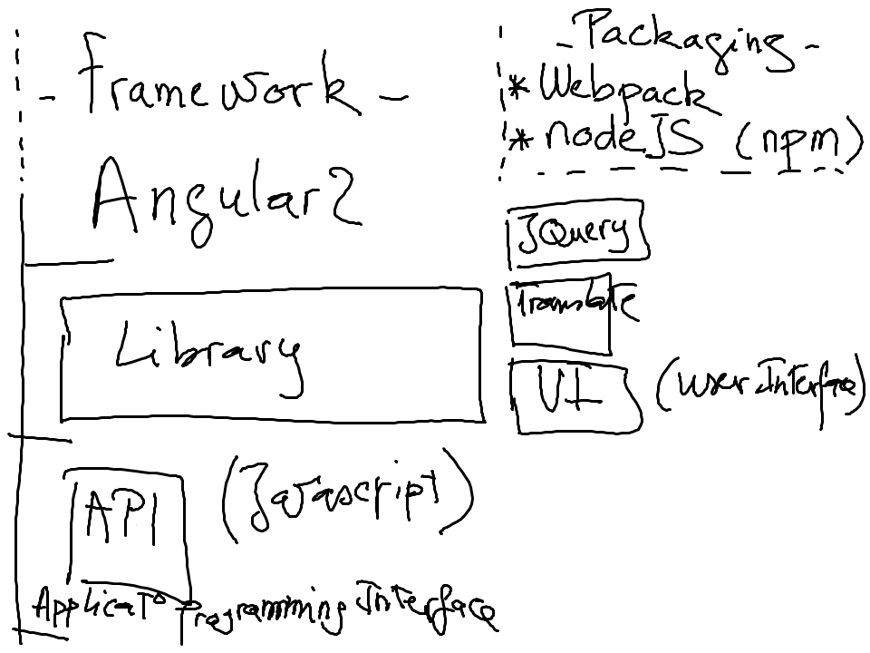

# Webpack



* Installer en ligne de commande

```
$ npm install --global webpack
```

* Executer l'exemple `Getting Started` dans votre repertoire (i.e. #Student Number)

https://webpack.js.org/guides/getting-started/

```
$ mkdir webpack-demo && cd webpack-demo
$ npm init -y
$ npm install --save-dev webpack
```


# Installation

https://webpack.js.org/guides/installation/


