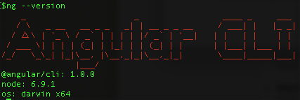

# Angular

## Node.js

## Téléchargement

Suivre les instructions pour installer

https://nodejs.org/en/download/

## Versions minimales de Node and npm
```
$ node --version
v6.9.1
$ npm --version
3.10.8
```

## Angular-cli

### Site

https://cli.angular.io/

### Installation

```
$ npm install @angular/cli --global
```

### Version minimale de Angular CLI

```
$ ng --version
```



## Créer un nouveau projet en utilisant SCSS

* remplacer monprojet par mon numero d'étudiant précédé de B comme Boréal (i.e. B300098957)

```
$ ng new monprojet --style=scss
```
