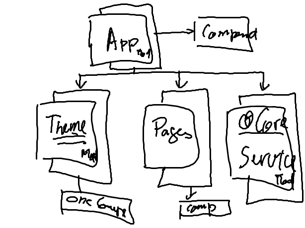

# Theme Module

`Creating a Theme Module using` [AKVEO/Nebular](https://akveo.github.io/nebular/#/docs/getting-started/what-is-nebular)

## Modular Design



## Create Angular-CLI project

```
$ ng new MyProject --style=scss --routing=true && cd MyProject
```

# Creating the @Theme Module

Follow the [Base](./docs/BASE.md) Documentation

# Adding the @Nebular Theme Module to the @Theme Module

Follow the [NB](./docs/NB.md) Documentation

# Enabling the @Nebular Theme System

Follow the [Theme](./docs/THEME.md) Documentation

# Create the application's Layout using @Nebular Layout Module

Follow the [Layout](./docs/LAYOUT.md) Documentation

# Add the pages Module

Follow the [Pages](./docs/PAGES.md) Documentation

# Add the application's Menu

Follow the [Menu](./docs/MENU.md) Documentation

# Enabling Authentication using @Nebular/auth

Follow the [@Nebular/Auth](https://akveo.github.io/nebular/#/docs/auth/installation) Installation

Follow the [@Nebular/Auth](https://akveo.github.io/nebular/#/docs/auth/configuring-a-provider) Configuration

Use the [@Nebular/Auth](https://akveo.github.io/nebular/#/docs/auth/getting-user-token) Token 
