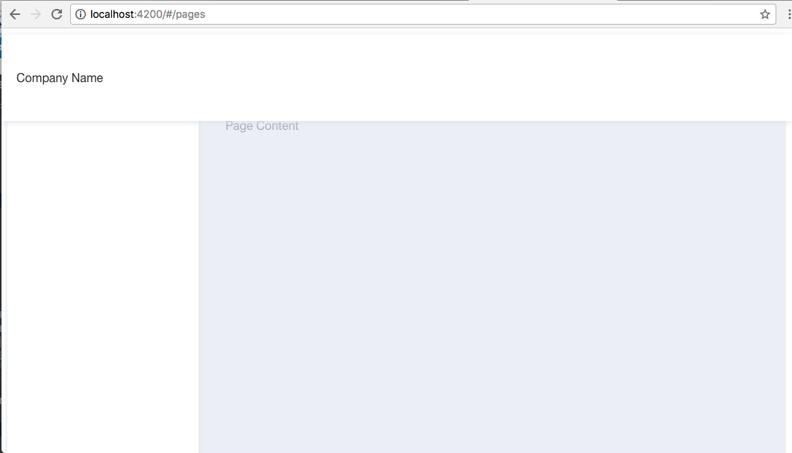

# Pages Module


## Create the pages Modules, Routing and Component

* Module plus Routing

```
$ ng g module pages --routing true
```

* Component (Simplified)

```
$ ng g component pages --inline-style true --inline-template true --spec false 
```

## Add the TheModule to `pages.module.ts` and One Column Layout

```Typescript
@NgModule({
  imports: [
    CommonModule,
    PagesRoutingModule,
    ThemeModule
  ],
  declarations: [PagesComponent]
})
export class PagesModule { }
```

## Add `One Column Layout` to the `pages.component.html`

```Typescript
@Component({
  selector: 'app-pages',
  template: `
    <app-layout-one-column>
      <router-outlet></router-outlet>
    </app-layout-one-column>
  `,
  styles: []
})
export class PagesComponent implements OnInit {

  constructor() { }

  ngOnInit() {
  }

}

```

## Add the PagesComponent to the Pages Routing

```
const routes: Routes = [{
  path: '',
  component: PagesComponent,
}];

@NgModule({
  imports: [RouterModule.forChild(routes)],
  exports: [RouterModule]
})
export class PagesRoutingModule { }
```

## Integration to the `app module`

--- Let's add the `Pages Module` to the main `App Module` by adding its route

--- Add the following code to the file `app-routing.module.ts` to the Constant `routes` 

```Typescript
  { path: 'pages', loadChildren: 'app/pages/pages.module#PagesModule' },
  { path: '', redirectTo: 'pages', pathMatch: 'full' },
  { path: '**', redirectTo: 'pages' },
```

. Final Result 

```Typescript
import { NgModule } from '@angular/core';
import {Routes, RouterModule, ExtraOptions} from '@angular/router';

const routes: Routes = [
  { path: 'pages', loadChildren: 'app/pages/pages.module#PagesModule' },
  { path: '', redirectTo: 'pages', pathMatch: 'full' },
  { path: '**', redirectTo: 'pages' },
];

const config: ExtraOptions = {
  useHash: true,
};

@NgModule({
  imports: [RouterModule.forRoot(routes, config)],
  exports: [RouterModule]
})
export class AppRoutingModule { }
```

--- Replace the app.component.html code to the below

```html
<router-outlet></router-outlet>
```

## Testing

http://localhost:4200

You should see a blank page


